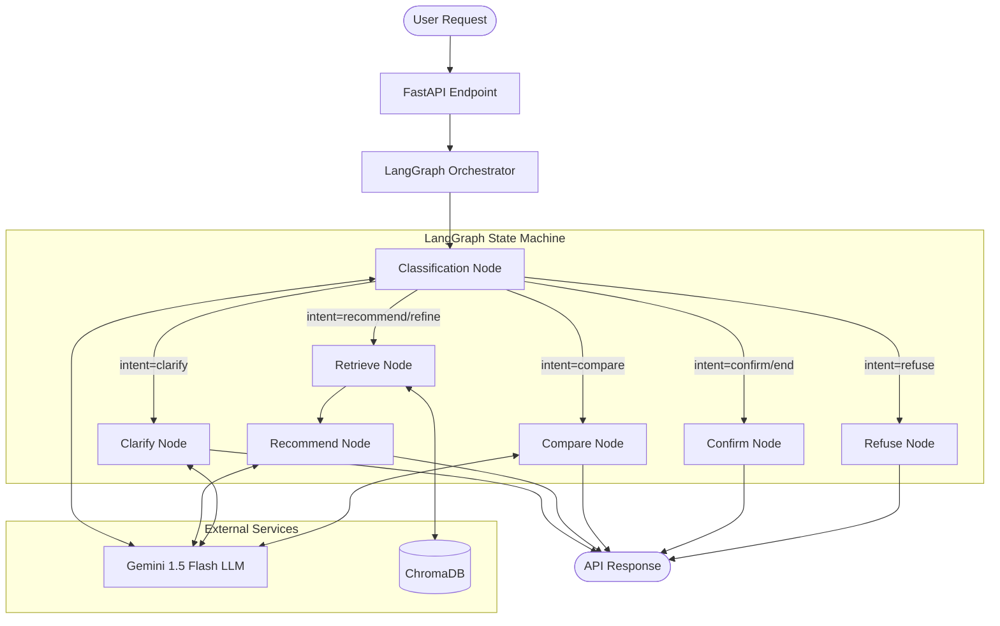

# SHL Assessment Advisor - Project Summary

## Executive Summary
The SHL Assessment Advisor is a conversational AI agent designed to guide hiring managers from vague role requirements to precise SHL assessment recommendations. By leveraging a multi-turn dialogue system, it clarifies intent, retrieves contextually relevant assessments, and ensures that recommendations are grounded strictly in the SHL catalog. The system is built for production readiness, offering high resilience, strong adherence to conversational boundaries (e.g., maximum turn limits), and protection against hallucinations.

---

## System Architecture

The following diagram illustrates the lifecycle of a user query and how it moves through the LangGraph state machine, interacts with the LLM, and retrieves context from the vector database.

---

## Technical Approach & Justifications

### 1. Agent Orchestration: LangGraph vs. ReAct
**Chosen Approach:** LangGraph
**Why:** The conversational flow for an assessment advisor involves highly predictable states: classifying intent, asking clarifying questions, retrieving information, and making recommendations. A standard ReAct loop can sometimes "hallucinate" an action when it gets confused. LangGraph enforces a strict state machine architecture where a `Classify` node acts as an immutable router. This guarantees, for instance, that the agent will not prematurely output a recommendation on turn 1 without sufficient context. It explicitly prevents recommending when it should be asking questions.

### 2. Retrieval Strategy: ChromaDB with Metadata Filtering
**Chosen Approach:** Semantic Search using ChromaDB with `all-MiniLM-L6-v2`
**Why:** ChromaDB provides zero-infrastructure overhead while persisting to disk, making it highly portable for deployment. The choice of `all-MiniLM-L6-v2` via `sentence-transformers` ensures that embeddings can be generated quickly and locally without incurring third-party API costs. It is highly adequate for our catalog size of ~55 products.
**Why Over Pure Semantic Search:** Pure vector search struggles with hard constraints (e.g., "only show remote-testable options"). We extract structured constraints during the classification phase and apply them as metadata filters *before* semantic search. This multi-pass hybrid approach filters out irrelevant tests immediately, leaving the semantic engine to handle only valid candidates. We retrieve 15 candidates and let the LLM narrow it down to the top 1-10, giving the LLM room to evaluate subtle suitability markers rather than just relying on raw vector distance.

### 3. LLM Selection: Gemini 1.5 Flash
**Chosen Approach:** Gemini 1.5 Flash
**Why:** For structured-output tasks on a small, well-defined catalog, the extreme reasoning capabilities of heavier models (like Gemini 1.5 Pro or GPT-4) are overkill. Gemini 1.5 Flash offers a massive context window to hold the full conversation history (enabling our required stateless API design), handles JSON output parsing flawlessly with few-shot prompting, and is roughly 5x faster than Pro models, significantly improving the user experience during a chat session.

### 4. Application Framework: FastAPI
**Chosen Approach:** FastAPI
**Why:** The assignment spec requires a stateless API (no server-side sessions). FastAPI is ideal for this because of its native Pydantic integration, which handles incoming and outgoing JSON schema validation out-of-the-box. It is fully asynchronous, allowing it to efficiently handle concurrent LLM requests and database calls without blocking.

### 5. System Resilience
**Chosen Approach:** Thread-safe Circuit Breakers
**Why:** External dependencies like LLM APIs and Vector Databases are prone to network blips, rate limits, or timeouts. We implemented custom circuit breakers wrapping both services. If an API fails 5 consecutive times, the circuit opens, immediately failing subsequent requests gracefully for 60 seconds (returning a clean service-unavailable message) instead of cascading failures, exhausting thread pools, and causing the entire server to hang.

---

## Evaluation & Guardrails

We have implemented strict guardrails to guarantee the agent acts exactly as specified by the business requirements:

1. **Hallucination Prevention:** The architecture mathematically prohibits URL hallucinations. The final recommendation node is constrained to only construct URLs that map explicitly to the structured catalog data retrieved in the previous step. Validations occur against `shl.com`.
2. **Turn Capping:** We enforce the strict 8-turn conversation limit at the API middleware level (HTTP 400). This ensures the LLM never has an opportunity to bypass or ignore the requirement through hallucination.
3. **Schema Compliance:** The output format (`reply`, `recommendations`, `end_of_conversation`) is strictly enforced through Pydantic schemas before returning the JSON payload.
4. **Off-Topic Refusal:** An explicit `refuse` node is built into the graph. If a user asks a question entirely unrelated to recruitment/assessments, the agent bypasses the retrieval pipeline entirely and returns a polite refusal.
